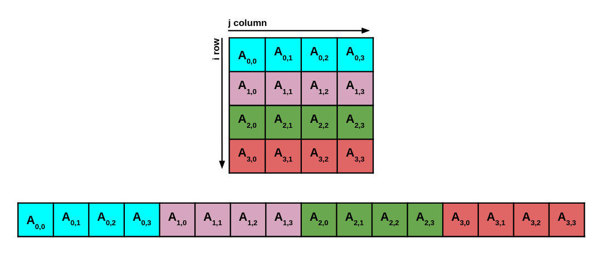

# HSF-India HEP Software Workshop at NISER 
## Introduction to GPU programming


### **Set-up instructions**

Start by launching the following notebook
```
https://binderhub.ssl-hep.org/v2/gh/research-software-collaborations/courses-hsf-india-december2023/gpugpu_true
```

### **Getting familiar with the GPU** 
Lets check how many / what type of GPUs are available in the system. To do this, simply run :
```
nvidia-smi
```
**Lets try to answer some questions :**
1. How many GPUs does the system have?
2. What type of GPUs does the system have?
3. What is the GPUs global memory?

## **Exercise 1:** "Hello world" with CUDA
During the lecture we saw a "Hello World" CUDA kernel. Lets try and run it ourselves! To compile and run the *cuda_hello.cu* CUDA script simply do :

```
nvcc cuda_hello.cu -o cuda_hello -gencode=arch=compute_61,code=sm_61
./cuda_hello
```
**Lets try and answer some questions :**
1. What do you observe? 
2. Why is this happening?
3. What can we do to fix this?

If you get stuck you can take a look at the *cuda_hello.cu* script in the *solutions* directory.

## **Exercise 2:** "Calculating a dot product" with CUDA
Goal of this excersise is to write a CUDA kernel that calculates the dot product of two vectors on the GPU.
- Start by tacking a look at the file **dot_product.cu**.
- Find and properly update all parts of the script denoted with **FIXME**.

To compile and run the CUDA script you can do :
```
nvcc dot_product.cu -o dot_product -gencode=arch=compute_61,code=sm_61
./dot_product
```

**Lets try and answer some questions :**
- When you dont make use of the CUDA specific atomicAdd() function, what do you observe? Is the result correct? Do you get consistent results if you run the kernel multiple times?
- Why is this happening?

If you get stuck you can take a look at the *dot_product.cu* script in the *solutions* directory.

## **Exercise 3 :** Matrix multiplication on the GPU
Goal of this excersise is to write a CUDA kernel that performs a 2-dimensional square matrix multiplication on the GPU. 
- Start by taking a look at the file **matrix_multiplication.cu**.  
- We can respresent the 2-D matrix in 1-D as shown in the image below. This will make copying the matrix from the host to device and from device to host easier. The size of each matrix is DSIZE*DSIZE.


- Find and properly update all parts of the script denoted with **FIXME**.

To compile and run the CUDA script you can do :
```
nvcc matrix_multiplication.cu -o matrix_multiplication -gencode=arch=compute_61,code=sm_61
./matrix_multiplication
```
**Lets try and answer some questions :**
- Compare the time it takes to perform the matrix multiplication on the CPU and the GPU. 
  - What do you observe? (Keep in mind that you are running on shared resources. You can try invoking the program a few times and then select the best run.)
- Try changing the size of the matrix by mutiplying *DSIZE* by 2,4, and 8.
  - What do you observe now? How does the CPU and GPU time scale? 

If you get stuck you can take a look at the *matrix_multiplication.cu* script in the *solutions* directory.

